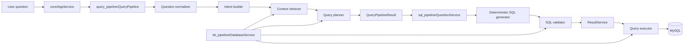

# SQLSense Pipeline Architecture

This document defines the active pipeline boundaries in the current SQLSense repository. It is intentionally aligned with the package structure used by the runtime.

## 1. Architectural rule

SQLSense separates database knowledge construction, question planning and SQL execution:

```text
kb_pipeline/
→ builds and maintains database knowledge assets

query_pipeline/
→ understands a user question and returns a deterministic plan

sql_pipeline/
→ generates, validates and executes deterministic read-only SQL
```

Runtime AI SQL generation and AI SQL repair are disabled. Optional AI is limited to Knowledge Base semantic enrichment.

---

## 2. End-to-end flow



---

## 3. `kb_pipeline/` — Database Knowledge Foundation

### Main entry point

- `kb_pipeline/database_service.py::DatabaseService`

### Build flow

```text
schema_reader.py
→ data_profiler.py
→ semantic_mapper.py
→ schema_facts.py
→ optional ai_semantic_enricher.py
→ business_glossary.py
→ relationship_graph.py
→ vector/index_builder.py
→ Chroma + fallback vector retriever
```

### Responsibilities

- connect to the active database;
- reflect tables, columns, primary keys and foreign keys;
- profile bounded schema/data evidence;
- add structural semantic types;
- optionally enrich semantic metadata during KB build only;
- build the business glossary;
- build authoritative Relationship Graph edges;
- persist and refresh vector evidence;
- bind persisted assets to database and schema fingerprints;
- reject stale KB/vector assets.

### Authority rule

The Relationship Graph is the only join authority. Glossary, vector results, sample values and AI metadata may provide semantic evidence but cannot approve a join.

---

## 4. `query_pipeline/` — User Question Understanding

### Main entry point

- `query_pipeline/query_pipeline.py::QueryPipeline.run`

### Stage flow

```text
normalize_question
→ build_intent
→ retrieve_context
→ build_query_context
→ QueryPipelineResult
```

### Responsibilities

- normalize the user question;
- build deterministic intent;
- retrieve KB/glossary/vector evidence;
- resolve tables, columns, roles, filters, dates, ranking and clauses;
- select graph-authorized direct or bounded multi-hop paths;
- analyze joined-aggregate grain;
- detect ambiguity and missing evidence;
- return a route, reason, query shape and clause plan;
- fail closed when planning cannot be proven safe.

### Planner modules

- `planner/role_resolver.py`
- `planner/filter_resolver.py`
- `planner/having_resolver.py`
- `planner/ranking_resolver.py`
- `planner/join_resolver.py`
- `planner/phase7_bfs_join_resolver.py`
- `planner/phase8a_grain_analyzer.py`
- `planner/phase9b_cache.py`
- `planner/phase9c_cache.py`
- `planner/contract_builder.py`
- `planner/confidence.py`

### Output contract

`QueryPipelineResult` contains:

- normalized question;
- intent;
- retrieved context;
- planner query context;
- query shape;
- clause plan;
- route recommendation and reason;
- `can_plan`;
- formula/evidence metadata;
- versioned pipeline contracts.

The query pipeline does not generate or execute SQL.

---

## 5. `sql_pipeline/` — SQL Generation and Execution

### Main orchestration

- `sql_pipeline/question_service.py::QuestionService`

### Generation paths

- `simple_query_generator.py` for simple list/count queries;
- `deterministic_sql_generator.py` for aggregates, filters, grouping, ranking and joins;
- `sql_generator.py` is a blocked legacy compatibility boundary whose AI runtime entry points raise errors.

### Validation

`sql_pipeline/sql_validator.py` checks:

- read-only SELECT safety;
- no comments, mutation commands or multiple statements;
- valid tables and columns;
- valid clause order;
- valid group/aggregate placement;
- Relationship Graph-approved join predicates;
- selected join-path agreement;
- date-column eligibility;
- two-edge aggregate grain contract.

### Execution

`sql_pipeline/result_service.py` stores the generated SQL and its planner context. `sql_pipeline/query_executor.py` validates again before SQLAlchemy execution.

---

## 6. Orchestration boundary

`core/app_service.py::AppService` coordinates the three pipelines:

```text
DatabaseService
→ QueryPipeline
→ QuestionService
→ SQL validation
→ ResultService
→ QueryExecutor
```

`AppService` also clears runtime and cache state when the database changes, reports vector/KB status, and emits observability events.

---

## 7. Delivery layers

### API

`api_gateway/app.py` exposes a FastAPI gateway for:

- session state;
- database connect/disconnect/status;
- KB status/rebuild;
- query ask/last;
- history list/clear.

### Frontend

`forentendNew/` contains the React/TanStack web application.

### CLI

`main.py` is the source-controlled CLI entry point and delegates application work to `core.app_service.AppService`.

---

## 8. Current safety limits

- read-only `SELECT` only;
- deterministic runtime only;
- at most three unique tables;
- at most two graph-authorized edges;
- no ambiguous paths;
- no bridge or many-to-many aggregate paths;
- no unknown-cardinality aggregate paths;
- no parent-to-child row multiplication from metric grain;
- no runtime AI repair/retry;
- stale KB/schema evidence fails closed.

For the complete code-derived architecture, security model, deployment target and implementation roadmap, see `SQLSense_SYSTEM_DESIGN.md`. Public Python boundaries are listed in `ARCHITECTURE_CONTRACTS.md`.
