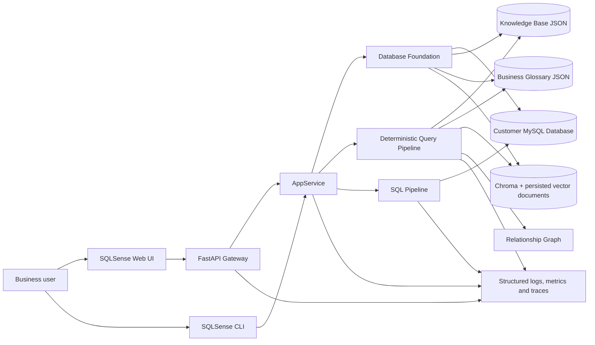
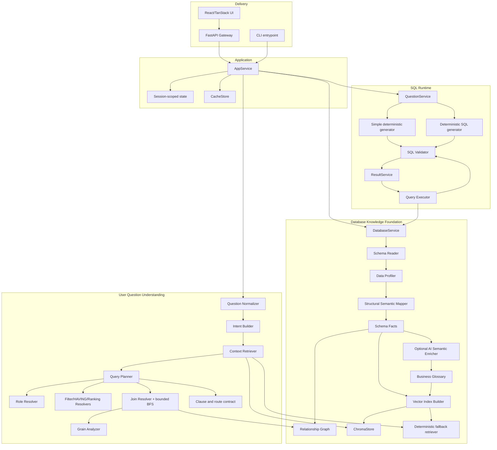
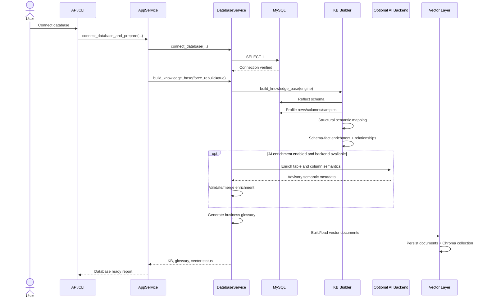
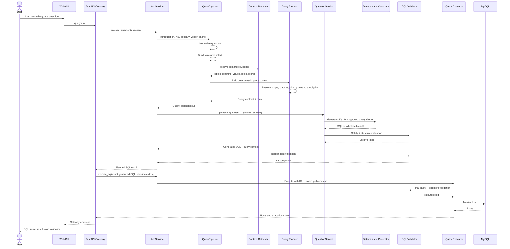
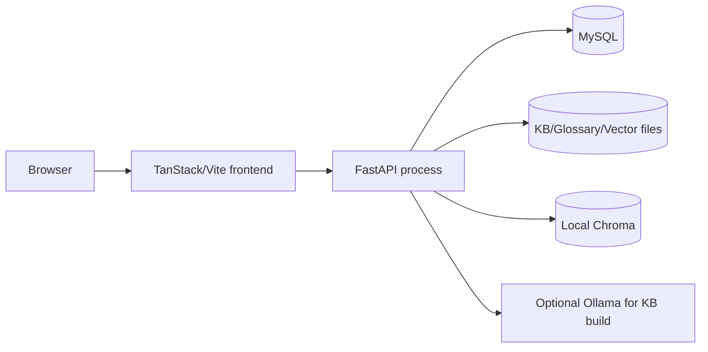
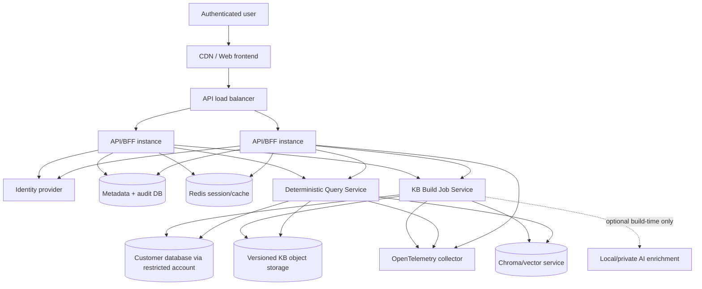

# SQLSense System Design

**Document status:** Code-derived architecture baseline  
**Reviewed project:** `SQL-Sense(15).zip`  
**Review date:** 2026-07-20  
**Primary runtime:** Python, SQLAlchemy, FastAPI  
**Frontend:** React 19, TanStack Start/Router/Query, Zustand  
**Current database runtime:** MySQL only

---

## 1. Purpose

SQLSense is a deterministic natural-language-to-SQL system. It connects to a relational database, builds a database Knowledge Base, retrieves semantic evidence for a user question, constructs a deterministic query plan, generates read-only SQL, validates that SQL against both safety rules and the current schema, and executes it only after revalidation.

The architecture intentionally separates:

1. **Knowledge construction**, where optional AI enrichment may be used.
2. **Runtime question processing**, where AI-based intent classification, SQL generation, SQL repair, retry, and insight generation are disabled.

This document describes the architecture that actually exists in the uploaded repository, identifies current production gaps, and defines the recommended target architecture without changing SQLSense's deterministic safety model.

---

## 2. Core architectural invariants

These rules are system-level invariants and must not be weakened by future phases.

1. Runtime question processing is deterministic.
2. AI is allowed only during Knowledge Base semantic enrichment.
3. Runtime AI SQL generation is blocked by explicit exceptions.
4. Runtime AI SQL retry and repair are blocked.
5. The Relationship Graph is the only authority that may approve joins.
6. Vector, glossary, samples, and AI metadata provide evidence; they do not authorize joins.
7. Only read-only `SELECT` SQL may execute.
8. Every generated SQL statement is validated before being stored.
9. SQL is revalidated immediately before execution.
10. Unknown, unsafe, stale, ambiguous, unsupported, or structurally invalid requests fail closed.
11. Current join scope is at most three unique tables connected by at most two approved edges.
12. Multi-table aggregate execution requires grain-preservation evidence.
13. Many-to-many, bridge-path, unknown-cardinality, and one-to-many grain-expanding aggregates are rejected.
14. Automatic `COUNT(DISTINCT ...)` must not be used to hide an unsafe grain decision.
15. No table, column, relationship, value, or business mapping may be hardcoded for a particular customer database.

---

## 3. System context



### External actors and systems

| Actor or system | Purpose |
|---|---|
| Business user | Asks questions without writing SQL. |
| Database administrator | Supplies a restricted database account and controls accessible schemas. |
| MySQL database | Authoritative schema and business data source. |
| Optional Ollama/NVIDIA backend | Used only during KB semantic enrichment. |
| Browser | Hosts the React/TanStack frontend. |
| ChromaDB | Semantic retrieval backend derived from the KB and glossary. |
| Optional Redis | Shared cache backend supported by the cache abstraction. |

---

## 4. Repository architecture

The active architecture is divided into three main pipelines and supporting delivery/infrastructure layers.

```text
SQL-Sense/
├── api_gateway/                 # FastAPI browser/backend boundary
├── core/                        # Application orchestration and shared services
├── kb_pipeline/                 # Database Knowledge Foundation
│   └── vector/                  # Embedding, Chroma, fallback retrieval and persistence
├── query_pipeline/              # Deterministic question understanding and planning
│   ├── conversation/            # Follow-up detection and deterministic rewriting
│   └── planner/                 # Resolvers, graph pathing, grain analysis and caches
├── sql_pipeline/                # SQL generation, validation, execution and result state
├── infrastructure/observability/# Context, structured events, metrics, tracing, redaction
├── forentendNew/                # React/TanStack user interface
├── semantic/                    # Persisted KB, glossary and compatibility modules
├── vector_store/                # Persisted vector documents and Chroma collection
├── db/                          # Compatibility import paths
├── tests/                       # Unit, integration, regression and live DB suites
└── scripts/                     # Live verification scripts
```

### 4.1 Active boundaries

| Boundary | Primary entry point | Responsibility |
|---|---|---|
| Application orchestration | `core/app_service.py::AppService` | Coordinates database preparation, planning, generation, validation and execution. |
| Database foundation | `kb_pipeline/database_service.py::DatabaseService` | Connection, KB lifecycle, glossary, schema identity and vector lifecycle. |
| Question planning | `query_pipeline/query_pipeline.py::QueryPipeline` | Normalize → intent → retrieve → plan. Does not generate SQL. |
| Planner | `query_pipeline/query_planner.py::build_query_context` | Resolves tables, fields, filters, clauses, joins, ambiguity and route. |
| SQL generation | `sql_pipeline/question_service.py::QuestionService` | Selects deterministic generator by query shape and blocks unsupported routes. |
| SQL validation | `sql_pipeline/sql_validator.py` | Safety, schema, clause, join and aggregate contract validation. |
| Execution | `sql_pipeline/query_executor.py` | Final validation and SQLAlchemy execution. |
| Web boundary | `api_gateway/app.py` | Session-scoped gateway actions and response redaction. |
| Frontend | `forentendNew/src` | Connection, ask workspace, result display, history, settings and incomplete schema explorer. |

### 4.2 Compatibility layers

The following packages mainly preserve old imports and should not become new implementation locations:

- `core/context_retriever.py`
- `core/database_service.py`
- `core/query_planner.py`
- `core/question_service.py`
- `db/`
- parts of `semantic/`

New logic should be added to `kb_pipeline/`, `query_pipeline/`, or `sql_pipeline/`, then exposed through a compatibility shim only when an existing import requires it.

---

## 5. Current high-level component design



---

## 6. Knowledge Base build-time design

### 6.1 Build sequence



### 6.2 Schema extraction

`kb_pipeline/schema_reader.py` uses SQLAlchemy metadata reflection and records:

- tables;
- column names;
- SQL data types;
- nullability;
- primary keys;
- foreign keys and referenced columns.

The reflected schema is authoritative. Semantic evidence may enrich it but must not contradict or replace physical metadata.

### 6.3 Data profiling

`kb_pipeline/data_profiler.py` currently performs per-table and per-column queries for:

- table row count;
- null and non-null counts;
- distinct count;
- up to five distinct sample values;
- minimum and maximum for numeric/date/time types.

Failures are recorded at table or column level so one profiling error does not terminate the complete KB build.

**Production concern:** current profiling can issue expensive full-table `COUNT(*)` and `COUNT(DISTINCT ...)` operations. The target design must add bounded sampling, per-query timeouts, table-size-aware policies, and an option to disable sensitive samples.

### 6.4 Structural semantic mapping

`kb_pipeline/semantic_mapper.py` applies structural classifications such as:

- identifier;
- date;
- boolean;
- numeric candidate;
- text candidate;
- category candidate;
- unknown.

It intentionally avoids database-specific name maps.

### 6.5 Optional AI enrichment

`kb_pipeline/ai_semantic_enricher.py` may enrich the KB at build time. `DatabaseService` supports local, NVIDIA, or configured custom backends through `core/ai_backend_service.py`.

Failure behavior is safe:

- an unavailable or timed-out AI backend does not stop KB creation;
- the rule-based KB remains usable;
- the build reports `completed`, `partial`, `fallback`, or `skipped` status;
- AI output remains advisory and is reprocessed through schema-fact contracts.

### 6.6 Business glossary

`kb_pipeline/business_glossary.py` generates terms that map business vocabulary to schema evidence. The glossary can nominate a table or column but cannot authorize a relationship.

### 6.7 Relationship Graph

`kb_pipeline/relationship_graph.py` builds a bidirectional traversal graph from persisted relationship evidence. Each edge includes authoritative source columns, relationship type, confidence, safety flags, and provenance.

Runtime join resolution uses safe graph edges only. The graph—not vector similarity or matching column names—is the join authority.

### 6.8 Vector retrieval layer

The vector layer contains:

- `EmbeddingService`;
- `VectorIndexBuilder`;
- `VectorIndexPersistence`;
- `ChromaStore`;
- deterministic in-process `VectorRetriever` fallback;
- `HybridVectorRetriever` when Chroma and fallback are both available.

The persisted vector manifest is tied to:

- database engine/name/host/port;
- schema hash/fingerprint;
- Knowledge Base hash;
- glossary hash;
- embedding backend/model/dimension;
- vector index contract version.

A stale database or schema identity blocks reuse or triggers a rebuild according to the active KB origin.

---

## 7. Runtime question-processing design

### 7.1 Runtime sequence



### 7.2 QueryPipeline responsibilities

`query_pipeline/query_pipeline.py` has a clean stage boundary:

```text
normalize_question
→ build_intent
→ retrieve_context
→ build_query_context
→ return QueryPipelineResult
```

It explicitly does not generate SQL or invoke runtime AI.

Its structured result includes:

- normalized question;
- intent;
- retrieved context;
- planner plan;
- query context;
- query shape;
- clause plan;
- route recommendation and reason;
- `can_plan` flag;
- formula evidence;
- evidence sources;
- versioned retrieval/planner/result contracts.

### 7.3 Intent Builder

The intent builder recognizes deterministic query requirements such as:

- list/count intent;
- aggregate operation;
- metric and dimension phrases;
- filters;
- intervals;
- ranking direction and limit;
- join lookup requests;
- requested output fields.

Relative dates may be made reproducible in tests through `SQLSENSE_FIXED_TODAY`.

### 7.4 Context Retriever

The retrieval boundary uses KB, glossary, profiles and vector evidence. Phase 9C adds caching around retrieval and planner evidence while validating cached references against the active schema.

The retrieval layer may return:

- matched tables;
- matched columns;
- metric candidates;
- dimension/date/filter candidates;
- evidence scores;
- ambiguity candidates;
- retrieval sources.

It must not return an executable join decision.

### 7.5 Planner and resolvers

The planner delegates focused decisions to modules under `query_pipeline/planner/`:

| Module | Responsibility |
|---|---|
| `role_resolver.py` | Deterministic metric/dimension candidate scoring and decision contracts. |
| `filter_resolver.py` | Row-level filters, values and interval predicates. |
| `having_resolver.py` | Aggregate threshold conditions. |
| `ranking_resolver.py` | Top/bottom, ordering and limits. |
| `join_resolver.py` | Direct joins, joined lookup/aggregate planning and graph evidence. |
| `phase7_bfs_join_resolver.py` | Unique bounded multi-hop path resolution. |
| `phase8a_grain_analyzer.py` | Aggregate grain preservation. |
| `contract_builder.py` | Query shape, clause plan, route and decision path. |
| `confidence.py` | Confidence calculation and ambiguity thresholds. |
| `phase9b_cache.py` | Graph path and grain analysis caching. |
| `phase9c_cache.py` | Retrieval and planner evidence caching. |

### 7.6 Query shape contract

The current runtime supports these main query shapes:

| Query shape | Generator path | Status |
|---|---|---|
| `single_table_list` | `simple_query_generator.py` | Supported |
| `single_table_count` | `simple_query_generator.py` | Supported |
| `single_table_aggregate` | deterministic aggregate generator | Supported |
| `filtered_query` | deterministic generator | Supported |
| `grouped_aggregate` | deterministic generator | Supported |
| `ranking_query` | deterministic generator | Supported |
| `joined_lookup` | deterministic generator | Supported within path limits |
| `joined_aggregate` | deterministic generator | Supported when grain is proven safe |
| `multi_metric_aggregate` | none | Fails closed |
| `formula_query` | none | Not implemented; fails closed |
| unknown/ambiguous/unsafe | none | Fails closed |

### 7.7 Planner output contract

A successful planner result contains enough evidence for generation and independent validation. Important fields include:

```json
{
  "route_recommendation": "deterministic_sql_required",
  "route_reason": "...",
  "can_plan": true,
  "query_shape": "joined_aggregate",
  "selected_table_names": ["payments", "orders", "customers"],
  "selected_metric": {
    "table": "payments",
    "column": "amount"
  },
  "selected_dimensions": [
    {"table": "customers", "column": "customer_name"}
  ],
  "selected_filters": [],
  "selected_join_path": {
    "base_table": "payments",
    "joined_tables": ["orders", "customers"],
    "path_source": "relationship_graph",
    "ambiguity_status": "resolved",
    "edges": [
      {
        "from_table": "payments",
        "from_column": "order_id",
        "to_table": "orders",
        "to_column": "order_id"
      },
      {
        "from_table": "orders",
        "from_column": "customer_id",
        "to_table": "customers",
        "to_column": "customer_id"
      }
    ]
  },
  "phase8a_grain_analysis": {
    "status": "grain_preserved",
    "grain_preserved": true
  },
  "clause_plan": {
    "clause_shape": "joined_aggregate",
    "requires": {
      "aggregate": true,
      "metric": true,
      "dimension": true,
      "where": false,
      "having": false,
      "order_by": true,
      "limit": true,
      "join": true
    },
    "decision_path": []
  },
  "missing_evidence": [],
  "ambiguities": []
}
```

---

## 8. Join and grain-safety design

### 8.1 Direct joins

The planner checks for a safe direct relationship first. A direct join is accepted only when:

- the two tables exist in the active schema;
- the Relationship Graph has a matching safe edge;
- required columns exist;
- the relationship is unambiguous;
- the SQL `ON` equality matches the selected graph edge.

### 8.2 Multi-hop joins

`phase7_bfs_join_resolver.py` is a bounded fallback. Current limits are:

- maximum three unique tables;
- maximum two ordered edges;
- no cycles or repeated tables;
- graph-safe edges only;
- exactly one acceptable path;
- ambiguous paths fail closed.

### 8.3 Grain analysis

For joined aggregates, `phase8a_grain_analyzer.py` checks the selected path from the metric base table.

A path is accepted only when every edge:

- is present in the Relationship Graph;
- is backed by safe database foreign-key metadata;
- has PK/FK ownership evidence;
- is traversed many-to-one from the metric grain;
- is not a bridge or many-to-many edge.

Possible grain statuses are:

- `grain_preserved`;
- `row_multiplication_risk`;
- `unknown_cardinality`;
- `unsupported_bridge_path`.

Only `grain_preserved` may authorize the aggregate route.

---

## 9. Deterministic SQL generation

### 9.1 Generator selection

`QuestionService` selects a generator by planner-approved query shape:

- simple list/count → `generate_simple_sql`;
- single-table aggregate → `generate_single_table_aggregate_sql`;
- filtered/grouped/ranking/joined queries → `generate_deterministic_sql`.

The generator consumes the query contract. It must not independently reinterpret the user's question or invent missing evidence.

### 9.2 Runtime AI barrier

`sql_pipeline/sql_generator.py` is retained as a compatibility boundary. Its runtime entry points deliberately raise `RuntimeError`:

- `generate_sql`;
- `generate_sql_with_retry`;
- backend call helpers.

This ensures a legacy import cannot silently reactivate runtime LLM SQL generation.

### 9.3 SQL construction rules

Generated SQL should use:

- explicit table and column identifiers;
- qualified columns for joined queries;
- collision-safe aliases;
- graph-approved `INNER JOIN` clauses;
- deterministic `WHERE`, `GROUP BY`, `HAVING`, `ORDER BY` and `LIMIT` clauses;
- no `SELECT *` for broad joined projections;
- a maximum user limit of 1000 in current planner contracts.

---

## 10. Validation and execution design

### 10.1 Validation layers

SQL is validated at multiple boundaries:

1. Inside `QuestionService` after deterministic generation.
2. Inside `AppService` before the generated SQL is stored.
3. Inside `ResultService` before execution.
4. Inside `query_executor.execute_query` immediately before the database call.

### 10.2 Safety validation

`validate_sql` enforces:

- string and non-empty input;
- `SELECT` prefix;
- no comments;
- no forbidden mutation/DDL keywords;
- no multiple statements;
- no explanation text, markdown wrapper or SQL trailer.

### 10.3 Structural validation

`validate_sql_structure` enforces:

- a valid `SELECT ... FROM ...` shape;
- valid clause order;
- valid `ORDER BY` and `LIMIT` forms;
- no dangling select expressions;
- all referenced tables exist;
- columns exist and resolve to valid owners;
- joins have complete predicates;
- join equalities match Relationship Graph evidence;
- aggregate columns and grouping are compatible;
- aggregate expressions do not appear in invalid clauses;
- date predicates target date-eligible columns;
- two-edge joined aggregates match the selected path and grain contract.

### 10.4 Execution context binding

`AppService` stores the generated SQL, selected join path and full query context. During execution, planner context is forwarded only when the submitted SQL exactly equals the stored SQL.

This protects graph- and grain-sensitive validation from being applied to a modified statement under the original plan.

**Target hardening:** execution should reject any non-identical SQL rather than merely dropping planner context and attempting generic validation. The executable artifact should be represented by an immutable signed/hash-bound execution token containing SQL hash, KB fingerprint, schema fingerprint, planner contract version and expiry.

### 10.5 Database execution

The executor uses SQLAlchemy `text(sql)` on a live engine and returns rows as dictionaries.

**Required production additions:**

- enforce a read-only database account;
- configure server-side statement timeout;
- cap returned rows independently of generated `LIMIT`;
- add connection-pool limits and recycle settings;
- cancel abandoned requests;
- add a per-tenant concurrency limit;
- never expose raw driver errors to untrusted clients.

---

## 11. Cache architecture

### 11.1 Cache foundation

`core/cache_service.py` implements a versioned cache contract with:

- disabled backend;
- in-memory LRU-style backend;
- Redis backend;
- TTL;
- namespace invalidation;
- cache envelope validation;
- sensitive-data rejection;
- hit/miss/stale/invalid/corrupt metrics.

### 11.2 Cache identity

Cache keys are bound to:

- database engine, host, port and name;
- schema hash;
- KB fingerprint;
- graph fingerprint;
- cache contract version;
- artifact type;
- normalized input;
- planner options.

This prevents a result for one schema or database from being reused for another.

### 11.3 Cached artifacts

Phase 9 currently caches evidence and deterministic intermediate decisions—not SQL result rows:

- safe direct relationships;
- bounded multi-hop paths;
- grain analysis;
- retrieval evidence;
- planner evidence summary.

Cached evidence is revalidated against the active schema before use. Forbidden authority keys are rejected so cached retrieval evidence cannot become a join authority.

---

## 12. Observability architecture

`infrastructure/observability/` provides:

- request/session/database context using `contextvars`;
- structured event logging;
- redaction;
- in-memory/no-op metrics abstractions;
- in-memory/no-op tracing abstractions;
- timed stages.

Important events include:

- request received/completed/rejected;
- KB build completed/failed;
- question normalized;
- intent completed;
- retrieval completed;
- planner completed/failed closed;
- SQL generated;
- SQL validation passed/rejected;
- execution completed/failed;
- cache read/write outcomes.

### Production telemetry requirements

- export metrics to Prometheus/OpenTelemetry-compatible systems;
- export traces through OpenTelemetry;
- add dashboarding for latency and fail-closed reasons;
- add alerting for KB build failure, stale schema, execution errors and cache corruption;
- preserve redaction of credentials, tokens, cookies and sensitive sample values.

---

## 13. API gateway design

### 13.1 Current contract

The FastAPI gateway exposes:

- `GET /health`;
- `POST /api/v1/gateway` with an `action` and strict action-specific payload.

Supported actions:

```text
session.status
session.reset
database.connect
database.disconnect
database.status
knowledge.status
knowledge.rebuild
query.ask
query.last
history.list
history.clear
```

The response envelope is:

```json
{
  "ok": true,
  "request_id": "...",
  "action": "query.ask",
  "data": {},
  "error": null
}
```

Errors use the same HTTP response shape and include a code, redacted message and optional redacted details.

### 13.2 Current session model

`SessionStore` keeps one `AppService` instance and up to 50 history entries in process memory per cookie session.

This is suitable for local development, but not for production because:

- session state is lost on process restart;
- sessions are not shared between workers;
- horizontal scaling is not possible without sticky sessions;
- database engines live inside a web process session object;
- the cookie is not an authenticated identity;
- there is no tenant or role authorization model.

### 13.3 Recommended production API model

Replace action dispatch with explicit resource endpoints or retain the gateway only as an internal BFF facade:

```text
POST   /api/v1/connections/test
POST   /api/v1/connections
DELETE /api/v1/connections/{id}
GET    /api/v1/connections/{id}/status
POST   /api/v1/knowledge-bases
GET    /api/v1/knowledge-bases/{id}/status
GET    /api/v1/schema/tables
POST   /api/v1/queries/plan
POST   /api/v1/queries/{query_id}/execute
GET    /api/v1/queries/{query_id}
GET    /api/v1/history
DELETE /api/v1/history
```

The plan/execute split is recommended for audited production usage. A configuration flag can preserve the current safe auto-execution UX.

---

## 14. Frontend design

### 14.1 Current frontend stack

- React 19;
- TanStack Start and Router;
- TanStack Query;
- Zustand persisted UI preferences;
- Radix UI primitives;
- Tailwind CSS;
- Recharts;
- TanStack server entry and SSR error boundary.

### 14.2 Current user pages

- connection page;
- ask workspace;
- query history;
- schema explorer shell;
- settings;
- application shell and connection guard.

### 14.3 Current frontend/backend mismatches

1. The frontend offers MySQL and PostgreSQL, while `kb_pipeline/connection.py` declares MySQL as the only active database type.
2. `api.testConnection()` calls `database.connect`, which performs connection plus a forced KB build. `api.connect()` calls the same method, so using Test and then Connect can repeat the full preparation flow.
3. The frontend displays simulated KB stages after the backend has already completed the synchronous request.
4. `listTables()` calls only `knowledge.status` and then returns an empty array; the Schema Explorer is not connected to a schema endpoint.
5. The frontend's persisted `connected` flag is local UI state and is not authoritative after a backend restart or expired session.
6. The API auto-executes `query.ask`; the UI cannot display an approved plan before execution.

### 14.4 Recommended frontend state model

The backend must remain authoritative for:

- session status;
- database connection state;
- KB readiness;
- active schema fingerprint;
- last query artifact;
- execution state.

Zustand should persist only presentation preferences and non-sensitive saved profile fields. On app startup, the frontend should reconcile with `session.status` and `database.status` before entering protected routes.

---

## 15. Persistence and state

### 15.1 Current persisted artifacts

| Artifact | Current location |
|---|---|
| Knowledge Base | `semantic/knowledge_base.json` |
| KB metadata | `semantic/knowledge_base.meta.json` |
| Business glossary | `semantic/business_glossary.json` |
| Vector documents | `vector_store/index/documents.json` |
| Vector manifest | `vector_store/index/manifest.json` |
| Chroma data | `vector_store/chroma/` |
| Conversation exports | `output/conversations/` |
| Logs | `logs/app.log` |

### 15.2 Production persistence design

Current global paths should be replaced with tenant/database-version namespaces:

```text
data/
└── tenants/{tenant_id}/
    └── databases/{connection_id}/
        └── kb/{kb_version}/
            ├── knowledge_base.json
            ├── glossary.json
            ├── metadata.json
            ├── vector_manifest.json
            └── vector_documents.json
```

A metadata database should track:

- tenant;
- connection identifier;
- encrypted secret reference;
- database identity;
- KB version and state;
- schema fingerprint;
- build timestamps;
- vector version;
- active/inactive status;
- query audit records.

---

## 16. Security architecture

### 16.1 Database security

The connected database account must have:

- `SELECT` only;
- access only to approved databases/schemas;
- no DDL/DML permissions;
- no file access;
- no stored procedure execution unless explicitly reviewed;
- a resource group or timeout policy where supported.

Application validation is defense in depth, not a replacement for database permissions.

### 16.2 Secret handling

Current positive behavior:

- `DatabaseService.db_config` excludes the password;
- gateway responses remove password keys;
- observability has redaction utilities;
- frontend saved profiles exclude password.

Production requirements:

- secrets must be held in a secret manager;
- connection records store only a secret reference;
- cookies must use `Secure`, `HttpOnly`, appropriate `SameSite`, expiration and signing/encryption;
- API keys must never be persisted in browser storage;
- logs must never include connection URLs containing passwords.

### 16.3 Authentication and authorization

The current gateway has no user authentication or role-based access. Production must add:

- authenticated users;
- tenant isolation;
- RBAC for connection creation, KB rebuild, query planning and execution;
- per-database allowlists;
- audit trail for every query and execution;
- rate limiting and abuse protection.

### 16.4 Data privacy

Profiling and vector documents may contain sample values. Add:

- configurable exclusion patterns;
- sensitive-column detection;
- masking/tokenization;
- per-column permission flags;
- an option to build semantic metadata without storing raw samples;
- retention and deletion policies.

---

## 17. Current deployment and recommended target

### 17.1 Current local deployment



This is appropriate for development and a single-user local installation.

### 17.2 Recommended production deployment



### 17.3 Service separation rule

Start as a modular monolith, but preserve these deployable boundaries:

1. API/BFF;
2. deterministic query service;
3. KB build worker;
4. metadata/audit store;
5. vector service;
6. optional build-time AI service.

Do not introduce distributed services until load, isolation, or deployment needs justify them.

---

## 18. Reliability and performance requirements

### 18.1 Recommended service objectives

| Metric | Initial target |
|---|---|
| Planning availability | 99.9% excluding customer DB outages |
| Safe fail-closed correctness | 100% for known unsafe patterns |
| Runtime AI calls | 0 |
| P95 planning latency, warm cache | < 500 ms for small/medium KBs |
| P95 query execution overhead | < 100 ms excluding database time |
| KB asset/database identity mismatch | Must always block reuse |
| Query audit completeness | 100% of executions |

### 18.2 Degradation strategy

- AI enrichment failure → use rule-based KB.
- Chroma unavailable → use validated fallback vector retriever.
- cache unavailable → compute deterministically without cache.
- stale KB/schema identity → block planning and require rebuild.
- planner ambiguity → return choices or a precise missing-evidence message.
- observability export failure → do not block query processing, but preserve local structured logs.
- database execution failure → return a redacted execution error; never attempt AI repair.

---

## 19. Testing strategy

The repository already contains broad deterministic tests across phases, including:

- normalization and intent;
- retrieval and vector persistence;
- role/filter/ranking decision contracts;
- direct joins;
- two-edge BFS joins;
- joined lookup and aggregate generation;
- grain analysis;
- SQL structure validation;
- execution revalidation;
- cache layers;
- API gateway contract;
- observability;
- live regression scripts.

### Required CI layers

1. **Static checks**
   - format/lint/type checking;
   - import-boundary checks;
   - secret scanning.

2. **Unit tests**
   - all resolvers, contracts, validators and cache serialization.

3. **Integration tests**
   - SQLite only where semantics match;
   - MySQL container for dialect-specific behavior;
   - FastAPI gateway tests;
   - frontend API contract tests.

4. **Safety regression suite**
   - destructive natural language;
   - SQL injection;
   - comments and multiple statements;
   - unknown tables/columns;
   - graph-unauthorized joins;
   - path ambiguity;
   - stale KB;
   - row multiplication;
   - bridge/many-to-many aggregates;
   - modified SQL execution.

5. **Live verification**
   - natural-language question;
   - expected route and query shape;
   - required/forbidden SQL patterns;
   - direct SQL oracle;
   - expected fail-closed cases.

### Review verification performed on this archive

A focused test run covering the API gateway, QueryPipeline, Phase 9A cache and observability produced **47 passing tests and one failure**. The failure was only that `PIPELINE_ARCHITECTURE.md` was absent. This system-design delivery adds that required repository document.

---

## 20. Architecture gaps identified in the uploaded archive

### P0 — Correctness and safety

1. **Missing root `main.py` source**  
   The archive contains compiled `main.py` bytecode but not the source file. The CLI implementation cannot be fully reviewed, maintained or reliably packaged from this archive.

2. **Modified SQL is not categorically rejected at the AppService boundary**  
   Planner context is supplied only for exact stored SQL, but modified SQL may still undergo generic validation. Production execution should accept only an immutable planned query artifact.

3. **Execution resource controls are missing**  
   The executor has no explicit statement timeout, result-row cap, cancellation or concurrency guard.

4. **Global KB/vector paths are not multi-database safe**  
   Metadata detects mismatch, but one global persisted artifact set cannot safely serve concurrent users or databases.

### P1 — Product and integration

5. **Frontend database support disagrees with backend**  
   UI offers PostgreSQL; current connection layer supports MySQL only.

6. **Connection test performs full preparation**  
   Test and Connect both call `database.connect`, which includes a forced KB build.

7. **Schema Explorer has no backend contract**  
   `listTables()` returns an empty array after checking only KB status.

8. **In-memory gateway sessions prevent horizontal scaling**  
   AppService, engines and history are process-local.

9. **Frontend connection state can become stale**  
   Local state is not automatically reconciled with server session state.

### P2 — Maintainability and operations

10. **Compatibility packages duplicate module names**  
    Active and legacy paths increase the chance of importing the wrong implementation.

11. **No root dependency manifest was included**  
    The archive does not include `pyproject.toml`, `requirements.txt`, or equivalent Python packaging metadata.

12. **Profiling is potentially expensive**  
    Full counts and distinct counts can be unsafe for large operational tables.

13. **Synchronous KB build blocks the connection request**  
    Production should expose real build progress through a job/status model.

14. **The gateway lacks authentication and authorization**  
    Cookie session ID alone is not an identity or access-control mechanism.

---

## 21. Recommended implementation roadmap

### Phase SD-1 — Repository and contract stabilization

- restore the root `main.py` source;
- add `pyproject.toml` with pinned runtime/dev dependencies;
- keep `PIPELINE_ARCHITECTURE.md` and `SYSTEM_DESIGN.md` versioned;
- mark active versus compatibility modules;
- add import-boundary tests;
- document all public contracts.

**Do not change:** planner behavior, graph authority, SQL coverage or fail-closed rules.

### Phase SD-2 — Execution artifact hardening

Introduce a `PlannedQueryArtifact`:

```json
{
  "query_id": "uuid",
  "sql": "SELECT ...",
  "sql_hash": "sha256",
  "database_identity_hash": "sha256",
  "schema_fingerprint": "sha256",
  "kb_fingerprint": "sha256",
  "planner_contract_version": "...",
  "query_context": {},
  "created_at": "...",
  "expires_at": "..."
}
```

Execution must require the exact artifact and reject any SQL mismatch.

### Phase SD-3 — Connection and KB lifecycle correction

- separate `database.test` from `database.connect`;
- separate connection creation from KB build;
- add a real KB build status contract;
- namespace KB/vector assets by connection and version;
- add stale-schema detection before every planning request.

### Phase SD-4 — Frontend/API completion

- add schema table/column endpoint;
- reconcile frontend state from server on startup;
- remove PostgreSQL from UI until implemented, or add a real dialect adapter;
- display actual build stages rather than simulated delays;
- expose planner ambiguity choices safely;
- optionally add plan-before-execute mode.

### Phase SD-5 — Production security

- authentication and tenant isolation;
- RBAC;
- secret manager integration;
- secure signed cookies/tokens;
- audit records;
- rate limiting;
- restricted DB credentials;
- sensitive-profile controls.

### Phase SD-6 — Reliability and scaling

- Redis session/cache backend;
- metadata/audit database;
- bounded KB build worker;
- query timeout and row caps;
- OpenTelemetry export;
- containerized MySQL integration tests;
- deployment manifests and health/readiness checks.

---

## 22. Architecture decision records

### ADR-001: Runtime remains deterministic

**Decision:** No runtime AI for intent, planning, SQL generation, repair, retry or insights.  
**Reason:** Reproducibility, safety, explainability and strict database control.  
**Consequence:** Unsupported or ambiguous questions fail closed instead of being guessed.

### ADR-002: Relationship Graph is the only join authority

**Decision:** Semantic retrieval may nominate tables, but every join edge must exist in the persisted graph.  
**Reason:** Similar names and embeddings cannot prove relational correctness.  
**Consequence:** Some valid but undocumented relationships remain unavailable until the KB is rebuilt with approved evidence.

### ADR-003: Bounded multi-hop joins

**Decision:** Current runtime supports at most two edges and three unique tables.  
**Reason:** Keep validation, ambiguity and grain analysis tractable.  
**Consequence:** Wider paths fail closed.

### ADR-004: Aggregate paths require grain proof

**Decision:** Joined aggregates execute only when traversal from metric grain is proven many-to-one across safe FK edges.  
**Reason:** Prevent silent row multiplication.  
**Consequence:** Bridge, many-to-many, unknown-cardinality and parent-to-child aggregates remain blocked.

### ADR-005: Cache evidence, not authority

**Decision:** Cache deterministic evidence and intermediate decisions under schema/KB/graph fingerprints. Do not cache result rows as an authority.  
**Reason:** Preserve correctness and avoid stale or cross-database decisions.  
**Consequence:** Cache failure degrades performance only, not behavior.

---

## 23. Final target runtime flow

```text
Authenticated user
→ validated connection context
→ active KB/schema fingerprint check
→ normalize question
→ deterministic intent contract
→ versioned semantic evidence retrieval
→ deterministic candidate scoring
→ Relationship Graph join authorization
→ bounded path resolution
→ grain analysis
→ clause/query contract
→ deterministic SQL generation
→ safety validation
→ schema/relationship/aggregate validation
→ immutable planned-query artifact
→ execution authorization
→ final revalidation
→ read-only database execution with timeout and row cap
→ redacted result/audit/telemetry
```

The most important property is not that SQLSense answers every question. It is that every executed query is traceable to current schema evidence, a deterministic plan, an authorized relationship path, and repeatable validation.
